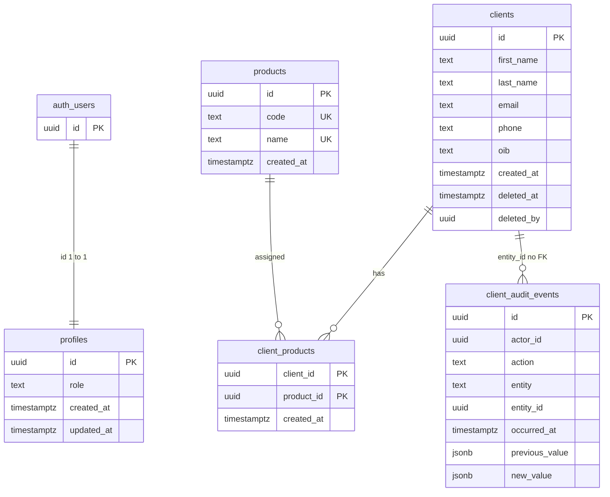

# Data model (relational schema)

Logical/physical schema as shipped in SQL. **Source of truth:
migrations**, not this diagram. Production apply is
`.github/workflows/production-smoke.yml` (SQL on `main`).

Row data (clients, profiles, assignments, audit) is **not** in git.
Only the product catalog is seeded in SQL.

## Migrations

| File                                                                                                                                       | Adds                                                                                   |
| ------------------------------------------------------------------------------------------------------------------------------------------ | -------------------------------------------------------------------------------------- |
| [`supabase/migrations/20260822150000_profiles.sql`](../../supabase/migrations/20260822150000_profiles.sql)                                 | `public.profiles`                                                                      |
| [`supabase/migrations/20260823190000_clients_and_audit.sql`](../../supabase/migrations/20260823190000_clients_and_audit.sql)               | `public.clients`, `public.client_audit_events`, audit trigger                          |
| [`supabase/migrations/20260823210000_products_and_soft_delete.sql`](../../supabase/migrations/20260823210000_products_and_soft_delete.sql) | `deleted_at` / `deleted_by`, `public.products` (6 seed rows), `public.client_products` |

`auth.users` is owned by Supabase Auth (not in our migrations).

Column lists and checks: [../features/CRM-001/implementation-plan.md](../features/CRM-001/implementation-plan.md) §3.

## Entity-relationship diagram

Notes aligned with SQL:

- `profiles.id` references `auth.users(id)` on delete cascade.
- `client_products.client_id` references `clients(id)` on delete cascade.
- `client_products.product_id` references `products(id)`.
- `client_audit_events.entity_id` is the client id at event time.
  **No foreign key**, so history can outlive a hard delete. UI delete
  is soft-delete (`deleted_at`).
- `profiles` is not an FK parent of `clients`. ADMIN/VIEWER is enforced
  by RLS using `profiles.role`.
- Unique active email: `clients_email_lower_key` on `lower(email)`
  where `deleted_at is null`.
- Product seed codes: `bank_account`, `credit_card`, `loan`,
  `savings`, `mobile_banking`, `online_banking`.
